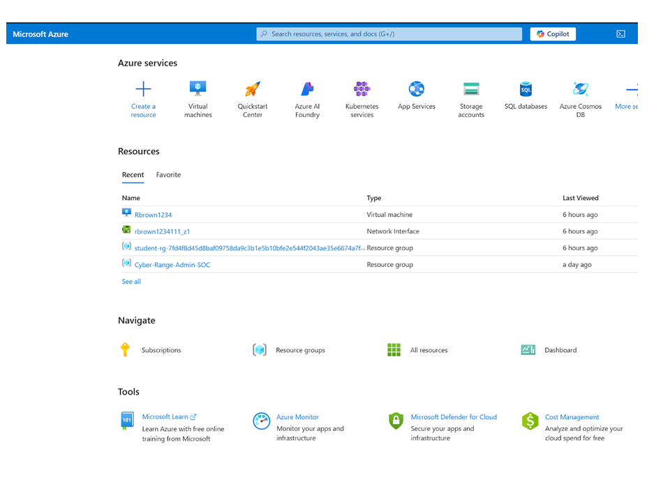
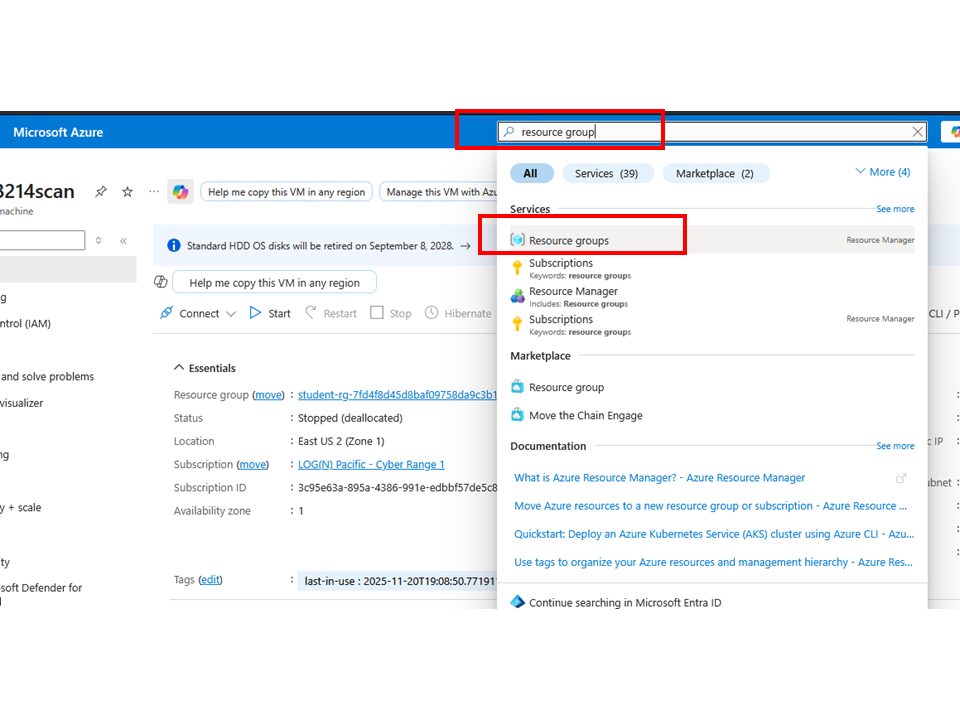
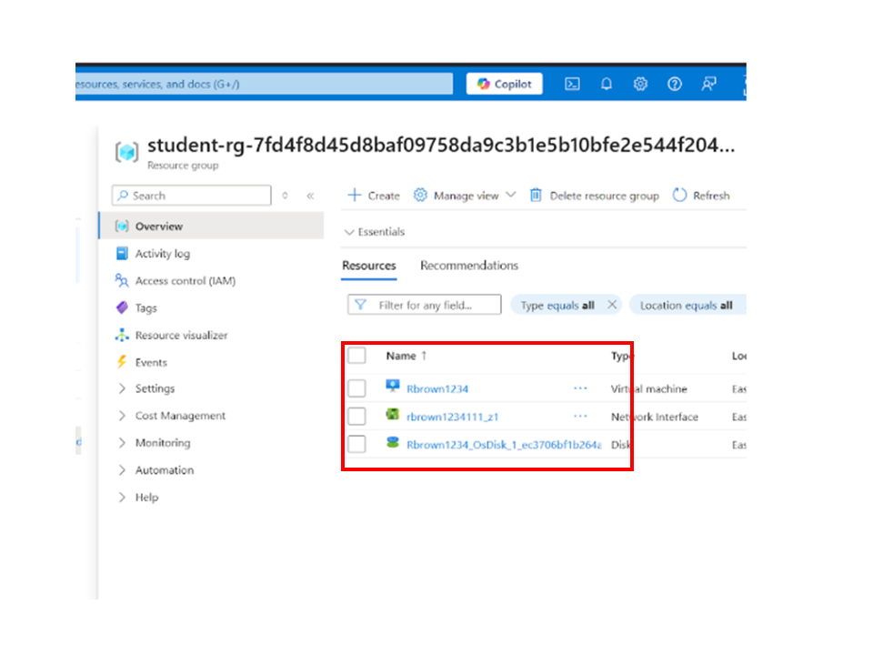
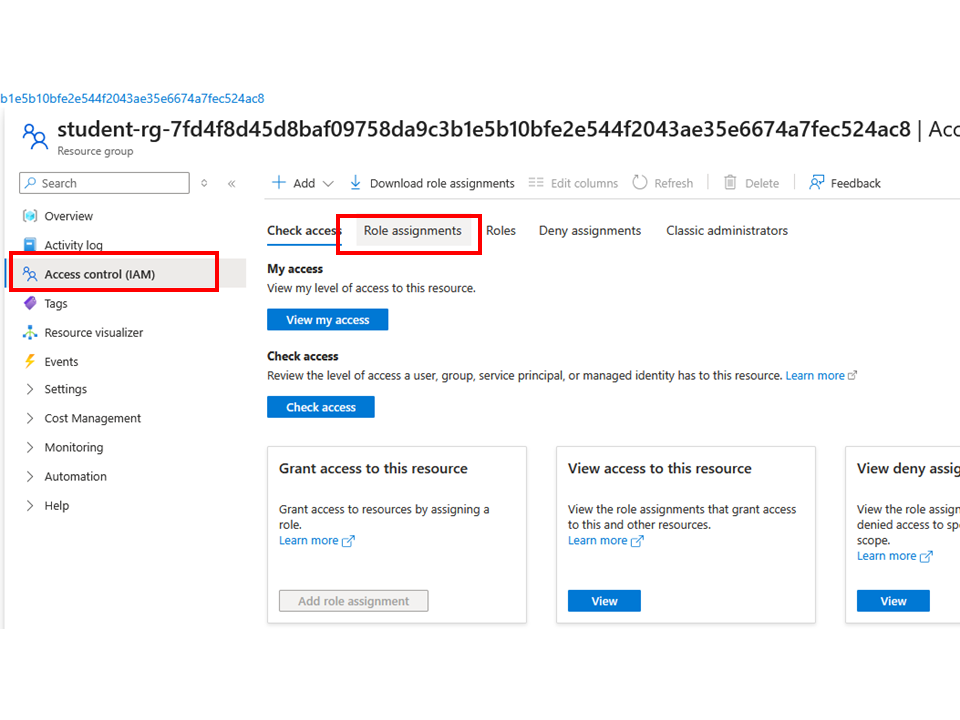

# Azure VM Management Lab (With and Without Public IP)

This repository documents a step-by-step lab for creating and managing a secure Virtual Machine (VM) in Microsoft Azure **without a public IP address**.  

You will learn how to:

- Create a VM with no public IP  
- Connect to the VM using Bastion  
- Reset the VM local administrator password  
- Log out of the VM  
- Start and stop the VM instance  
- Delete the VM and its network interface  

---

## 🎯 Agenda for This Lab

1. Create a Virtual Machine with or without **public IP**
2. Connect to the VM
3. Reset the VM password
4. Log out of the VM
5. Start and stop the VM instance
6. Delete the VM

---

## ✅ Prerequisites

- An active Azure subscription (or lab subscription, e.g., Cyber Range)
- Permissions to:
  - View and use a **Resource Group**
  - Create **Virtual Machines**
  - Use **Azure Bastion** (if provided)
- Access to the **Azure Portal**:  
  https://portal.azure.com

---

## Step 1 – Create a Virtual Machine (with or without Public IP)

### 1.1 Log In and Locate Your Resource Group

1. Sign in to the **Azure Portal**.
2. At the top search bar, type **“Resource groups”**.
3. Select **Resource groups** from the results.
4. Click the resource group that belongs to you (for example, your student or lab resource group).

   
    

> 💡 Anything in your resource group is managed by you, the administrator.

### 1.2 Check Your Access (Optional but Recommended)

1. In the left pane of your resource group, select **Access control (IAM)**.
2. Go to the **Role assignments** tab.
3. Review the list of users and roles.
   - If you see **Contributor**, that typically means admin-level permissions for that scope.

---

### 1.3 Start Creating the Virtual Machine

1. In the top search bar, type **“Virtual machines”** and select it.
2. You may see existing VMs created by admins or instructors (for example, Cyber-Range class VMs).
3. Click **Create** → **Azure virtual machine**.

You will now go through several tabs: **Basics**, **Disks**, **Networking**, **Management**, **Monitoring**, and **Review + create**.

---

### 1.4 Basics Tab

Fill in the fields according to your lab or organization’s standards:

- **Subscription**:  
  - Select the subscription assigned to you (e.g., `Cyber Range 1`).
- **Resource group**:  
  - Select the correct resource group (e.g., your student resource group).
  - Using the wrong one may cause confusion or policy issues.
- **Virtual machine name**:  
  - Example: `RBrown214`
- **Region**:  
  - Choose the region required by your organization.  
  - Example: **East US 2**
- **Availability options / zone**:  
  - Select what your organization or lab specifies.
- **Image**:  
  - Example: **Windows 11 Pro**
- **Size**:  
  - Select a recommended size.  
  - Example: **Standard_DS_v2** (avoid unnecessarily large/expensive options).
- **Administrator account**:  
  - Create a **username** and **password** that you will use to log into this VM.
- **Licensing**:  
  - Check the box confirming you are eligible for a Windows 11 license (if applicable).

Click **Next: Disks**.

---

### 1.5 Disks Tab

1. Choose the **OS disk type** according to your lab or organization’s recommendation.
   - Example: **Standard HDD** (cost-effective)
2. Keep other defaults unless instructed otherwise.
3. Click **Next: Networking**.

---

### 1.6 Networking Tab

Configure the networking carefully:

- **Virtual network**:  
  - Select the VNet assigned to your lab.  
  - Example: `CyberRange-VNet`
- **Subnet**:  
  - Example: `CyberRange-Subnet`
- **Public IP**:  
  - For this lab, set **Public IP = None** (no public IP).  
  - This is important for a more secure, private VM for vulnerability assessment.
- **Network security group (NSG)**:  
  - Select the recommended NSG (for example, a lab-provided NSG).
- **NIC network security group**:  
  - Use the organization’s standard configuration.
- **NIC delete option**:  
  - Check **"Delete NIC when VM is deleted"** so that the NIC is removed automatically with the VM.

Click **Next: Management**.

---

### 1.7 Management Tab

For this lab:

- Keep the default settings, unless your organization requires otherwise.
- No additional configuration is needed here.

Click **Next: Monitoring**.

---

### 1.8 Monitoring Tab

- **Boot diagnostics**: **Disable** (for this lab, we don’t need it).
- Keep other defaults as appropriate.

Click **Next: Review + create**.

---

### 1.9 Review + Create

1. Review all your settings:
   - Subscription
   - Resource group
   - VM name and size
   - Region
   - Disk type
   - Networking (verify **No Public IP**)
2. If everything looks correct, click **Create**.

Azure will begin deployment and show **“Deployment in progress”**.  
Once finished, you will see **“Your deployment is complete.”**

Click **Go to resource** to view your new VM.

---

## Step 2 – Connect to the VM via Bastion

1. In Azure, go to **Virtual machines** and locate your VM (e.g., `RBrown214`).
2. Open the VM.
3. At the top, click **Connect** → select **Bastion**.
4. In the Bastion screen:
   - Enter the **username** and **password** you set during VM creation.
   - Click **Connect**.

> ⚠️ If nothing happens, check your browser’s pop-up blocker and allow pop-ups for the Azure portal.

---

## Step 3 – Reset the VM Password (If Needed)

If you forget your password:

1. Make sure the VM is **Started**:
   - On the VM overview page, click **Start** if the VM is stopped.
   - Once running, **Start** will be grayed out and **Stop** will be active.
2. In the left pane of the VM, go to **Help** → **Reset password** (or **Password reset**).
3. Select the reset mode (e.g., **Reset password**).
4. Enter a new password and save.
5. Go back to **Connect → Bastion** and use the new credentials.

---

## Step 4 – Log Out From the VM

From inside the VM session:

1. Click the **Windows logo** (Start menu).
2. Click the **Power** icon.
3. Select **Shut down**.

This shuts down the guest OS, similar to turning off a physical desktop.

---

## Step 5 – Stop the VM in Azure

Even after shutting down inside the OS, you should also stop the VM resource in Azure to avoid unnecessary costs.

1. In the Azure portal, go back to **Virtual machines**.
2. Select your VM.
3. Click **Stop** at the top of the page.
4. Wait until the **Status** changes to **Stopped (deallocated)**.

> 💰 **Cost tip:** “Stopped (deallocated)” means the VM is fully stopped and no longer accumulating compute charges.

---

## Step 6 – Delete the VM

When you are completely done with the lab:

1. Go to **Virtual machines** (VM list view).
2. Check the box next to the VM you want to delete.
3. At the top, click the **three dots (More)** menu.
4. Select **Delete**.
5. In the confirmation dialog:
   - Type `delete`.
   - Check **Apply force delete** (if required).
   - Confirm the delete.

Because we selected **“Delete NIC when VM is deleted”**, the associated network interface will also be removed.

To verify deletion:

- Return to the **Virtual machines** list.
- The VM should no longer appear.

---

## 🧹 Cleanup Summary

By the end of this lab, you should have:

- Created a Windows VM with **no public IP**
- Connected via **Azure Bastion**
- Reset the local admin password (if needed)
- Logged out and shut down the VM
- Stopped the VM in Azure to avoid costs
- Deleted the VM and cleaned up networking resources

This pattern is a great foundation for secure, cost-aware VM management in enterprise or lab environments.
"# Azure-VM-Lab-with-without-public-IP" 
